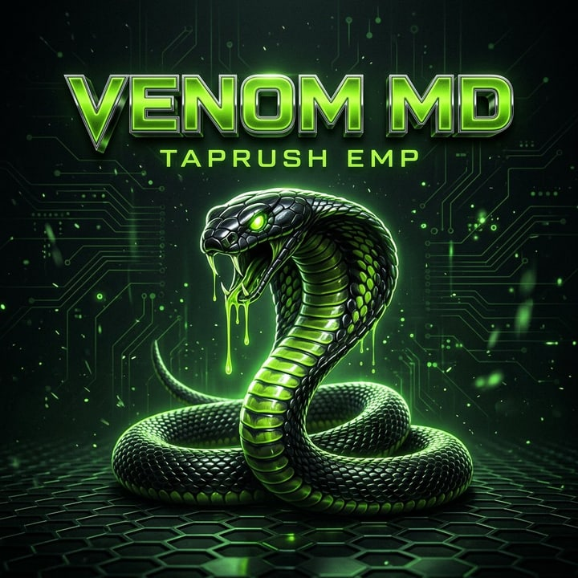

<!-- VENOM MD BOT — by TAPRUSH EMP (Micheal) -->

<div align="center">



<br/>

[](https://git.io/typing-svg)

<br/>

[](https://github.com/MykelGoal)
[](https://www.npmjs.com/package/baileys)
[](https://nodejs.org)
[](https://session-site-2odn.onrender.com)
[](https://youtu.be/ct4k9tfL1Fg)

<br/>

[](https://github.com/MykelGoal/VENOM-MD-BOT/stargazers)
[](https://github.com/MykelGoal/VENOM-MD-BOT/network/members)
[](https://github.com/MykelGoal/VENOM-MD-BOT)
[](LICENSE)

</div>

---

## 🐍 What is VENOM MD?

**VENOM MD** is a modular, plugin-driven WhatsApp bot on **Baileys v7** — fast, clean, and honest about what works. Every command is auto-discovered from `plugins/`. Maintained by **TAPRUSH EMP (Micheal) 🇳🇬**.

**No API keys to hunt for.** Keys and the database ship inside the code, so a fresh clone works out of the box.

<div align="center">

| ⌨️ Commands | 🗂️ Categories | 🔑 Keys Needed | 💾 Setup |
|:---:|:---:|:---:|:---:|
| **401** | **23** | **0** | **none** |

</div>

---

## ⚡ Quick Deploy

<div align="center">

| Platform | Deploy |
|----------|--------|
| **Render** | [](https://dashboard.render.com/web/new) |
| **Koyeb** | [](https://app.koyeb.com/services/deploy?type=git&repository=MykelGoal/VENOM-MD-BOT) |
| **Railway** | [](https://railway.app/new) |
| **Heroku** | [](https://dashboard.heroku.com/new?template=https://github.com/MykelGoal/VENOM-MD-BOT) |
| **Panel/ZIP** | [](https://github.com/MykelGoal/VENOM-MD-BOT/archive/refs/heads/main.zip) |

</div>

---

## 🎬 Tutorials

<div align="center">

| Video | Link |
|-------|------|
| 🚀 **How to Deploy a Free WhatsApp Bot (464 Commands) — VENOM MD 2026** | [Watch on YouTube](https://youtu.be/ct4k9tfL1Fg) |

</div>

> 📺 Full walkthrough — session ID, pairing, fork, and free Render deploy, step by step. Subscribe to **VENOM MD Tech** for more.

---

## 🛠️ Manual Deployment

```bash
git clone https://github.com/MykelGoal/VENOM-MD-BOT
cd VENOM-MD-BOT

npm install          # dependencies
npm run setup        # yt-dlp for downloaders

cp .env.example .env # set OWNER_NUMBER, then:
npm start
```

Scan the QR, or use a pairing code with `npm run pair`. On panels with no terminal, paste a [**SESSION_ID**](https://session-site-2odn.onrender.com) instead.

> 📖 Full walkthrough, hosting notes and runtime settings → **[docs/SETUP.md](docs/SETUP.md)**

---

## ✨ What makes it different

| | |
|:---|:---|
| 🔑 **Zero-key deploys** | Keys + MongoDB ship in [`src/builtin-keys.js`](src/builtin-keys.js). Your own always wins — `.env`, `.setkey` or `.setmongo`, live, no restart |
| 🎓 **VENOM SCHOOL** | The bot teaches its own commands 3× a day — lesson, pop quiz, register, and it **tags whoever skipped class** |
| 👥 **Staff roles** | admin · editor · mod · vip, each inheriting the last. Credentials and code stay owner-only, always |
| 🤝 **Affiliate** | Everyone gets a referral code and link; invites pay coins and earn VIP |
| 📡 **Downloads that survive hosting** | Six keyless YouTube routes with failover — `.play` and `.ytv` keep working where yt-dlp gets IP-blocked |
| 🎬 **`.capcut`** | Plain-English video editing: *"cut 0-10, speed 2x, add subtitles"* |
| 🍿 **`.movie`** | Say a film or episode by name and get the file |
| 🧹 **Self-cleaning DB** | Sweeps spent records every 6h so the free 512 MB never fills — balances and logins untouched |

---

## 📋 Commands

<div align="center">

| Category | Highlights |
|:---|:---|
| **FUN** · 58 | 43 reaction GIFs · `ship` `truth` `dare` `emojimix` `pokemon` |
| **TEXTMAKER** · 50 | `ttp` stickers + 47 text effects, all rendered locally |
| **GROUP** · 42 | `poll` `vcf` `kick` `promote` `mute` `tagall` `warn` `antilink` `welcome` |
| **CONVERTER** · 40 | `capcut` `sticker` `take` `mp4` `gif` `tomp3` `ptv` + 17 audio effects |
| **ECONOMY** · 38 | `daily` `work` `mine` `fish` `rob` `heist` · banking · `slots` `blackjack` |
| **UTILITIES** · 35 | `track` `requestloc` `tempmail` `quran` `praytimes` `weather` `wiki` `calc` `tts` `ss` `pdf` |
| **CONFIG** · 35 | `setvar` `mode` `forcejoin` `setrole` `school` `setmongo` `antidelete` |
| **IMAGE-MEME** · 29 | `fakechat` `wanted` `jail` `drake` `wasted` `triggered` `carbon` |
| **DOWNLOADER** · 26 | `movie` `play` `music` `video` `spotify` `tiktok` `instagram` `apk` |
| **AI** · 23 | 8 providers with failover — `ai` `gpt` `gemini` `groq` `imagine` `restyle` |
| **USER** · 36 | `clone` `unclone` `clonestatus` `cloneinfo` `pp` `rank` `affiliate` `mygrades` `classtop` |
| **TOOLS** · 21 | `snipe` `afk` `remind` `schedule` `setcmd` `msgs` `listonline` |
| **BOT** · 20 | `ping` `stats` `alive` `broadcast` `grouplist` `backup` `dbsize` |
| **SEARCH** · 13 | `news` `tvshow` `img` `wallpaper` `github` `lyrics` `shazam` |
| **SPORTS** · 2 | `pred` — daily top football picks, any league · `predkey` |
| **+9 more** | ANIME · IMAGE · GAME · MISC · PRIVACY · AUTOREPLY · PLUGINS · PROCESS · HELP |

</div>

> 💡 `.cmds` maps every category at a glance · `.menu` for everything · `.menu <category>` for one section · `.menu <command>` for a help card.

---

## 📚 Documentation

| Guide | What's inside |
|:---|:---|
| **[Setup & Hosting](docs/SETUP.md)** | Session ID, Render/Koyeb/Pterodactyl, `.setvar`, force-join gate |
| **[Database](docs/DATABASE.md)** | MongoDB, `.setmongo`, per-deploy isolation, housekeeping |
| **[Features](docs/FEATURES.md)** | School, roles, affiliate, downloaders, `.movie`, `.capcut`, AI |
| **[Developing](docs/DEVELOPING.md)** | Writing a plugin, architecture, testing, known limits |

---

## 📜 Credits

<div align="center">

| Role | Credit |
|:---|:---|
| 👨‍💻 Developer | **TAPRUSH EMP (Micheal)** — [@MykelGoal](https://github.com/MykelGoal) |
| 📦 Core Library | [Baileys v7](https://www.npmjs.com/package/baileys) |
| 🎞️ Media | [ffmpeg-static](https://www.npmjs.com/package/ffmpeg-static) · [sharp](https://sharp.pixelplumbing.com) |

</div>

---

## ⚖️ Notice

> Built for **educational purposes only**. **DO NOT misuse** this software.
> Redistribution without credit to the original author is **strictly prohibited**.

Licensed under [MIT](LICENSE).

---

<div align="center">

### ⭐ Star the repo if VENOM MD helped you

**《 POWERED BY TAPRUSH EMP 🇳🇬 》**

</div>
